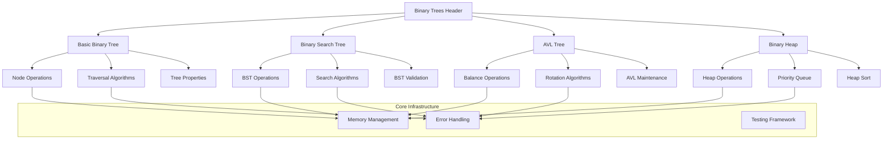
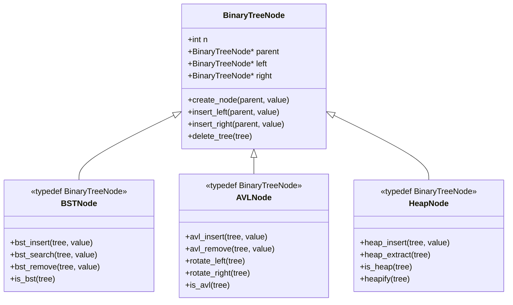
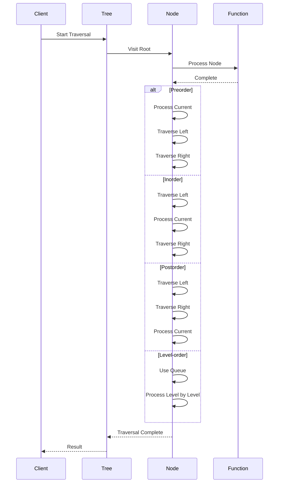
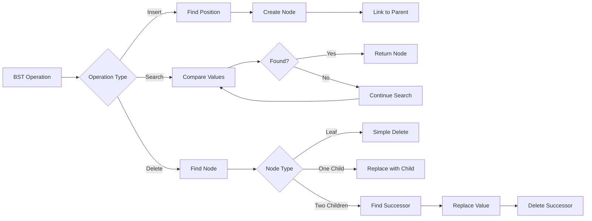
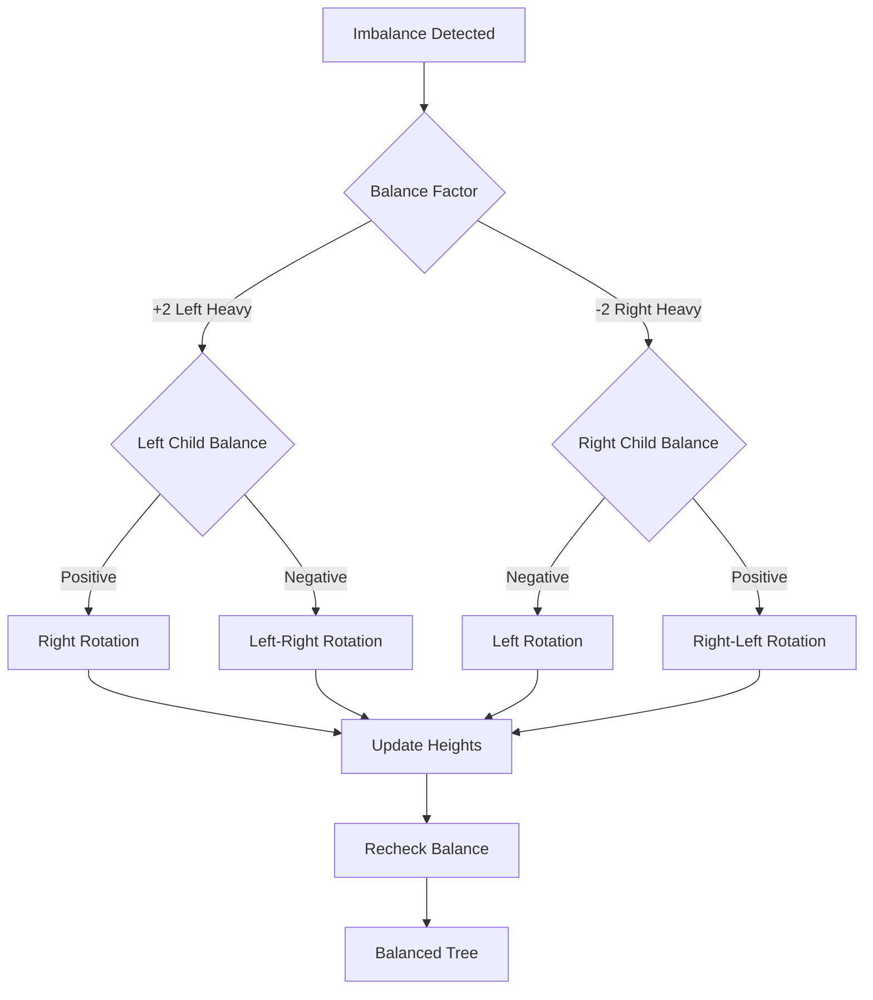
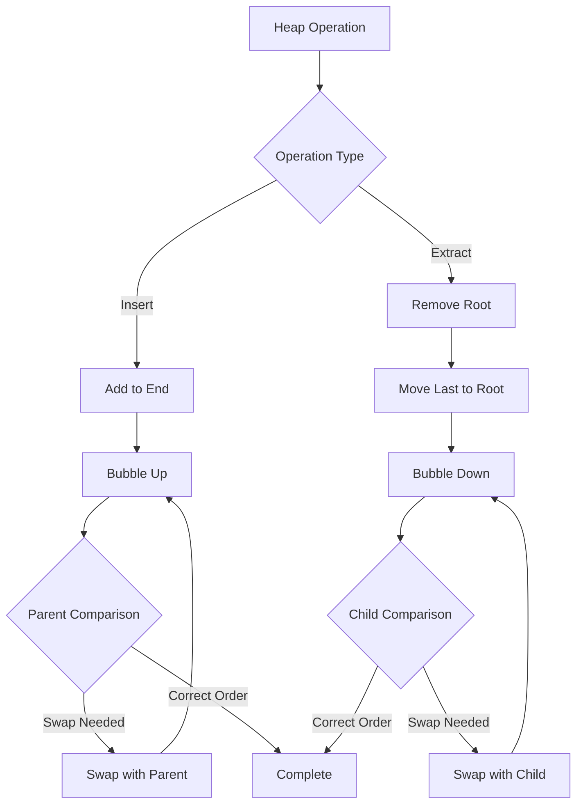
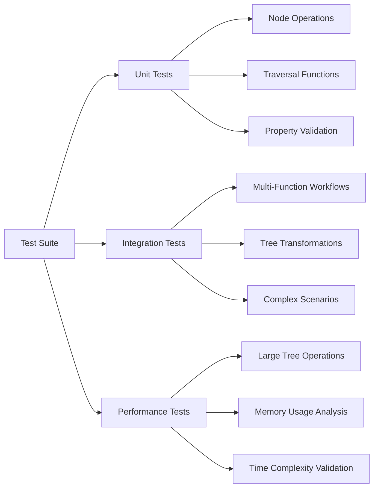

# 🏗️ System Architecture

## 📖 Overview
The Binary Trees project implements a comprehensive collection of tree data structures and algorithms in C, demonstrating advanced understanding of hierarchical data organization, memory management, and algorithm design. The architecture encompasses four major tree types: basic binary trees, binary search trees (BST), AVL trees, and binary heaps, each with complete CRUD operations and specialized algorithms.

---

## 🏛️ High-Level Architecture



The architecture follows a hierarchical design where all tree implementations share a common node structure while providing specialized operations for each tree type. This design promotes code reusability while maintaining type safety through typedef aliases.

---

## 🧩 Core Components

### Binary Tree Node Structure
- **Purpose**: Foundation data structure for all tree implementations
- **Technology**: C struct with integer data and pointer fields
- **Location**: `binary_trees.h`
- **Responsibilities**:
  - Store integer data values
  - Maintain parent-child relationships through pointers
  - Provide type definitions for specialized tree types
  - Enable memory-efficient tree representation

### Basic Binary Tree Operations
- **Purpose**: Fundamental tree manipulation and analysis
- **Technology**: C functions with recursive and iterative implementations
- **Location**: `0-binary_tree_node.c` through `18-binary_tree_uncle.c`
- **Responsibilities**:
  - Node creation and deletion
  - Tree traversal in multiple orders
  - Property validation (leaf, root, full, perfect, complete)
  - Relationship finding (sibling, uncle, ancestor)

### Binary Search Tree Implementation
- **Purpose**: Ordered tree structure with logarithmic search complexity
- **Technology**: C implementation maintaining BST invariants
- **Location**: `110-binary_tree_is_bst.c` through `114-bst_remove.c`
- **Responsibilities**:
  - Maintaining sorted order property
  - Efficient search, insertion, and deletion
  - BST validation and verification
  - Array-to-BST conversion

### AVL Tree Self-Balancing System
- **Purpose**: Self-balancing binary search tree with guaranteed O(log n) operations
- **Technology**: C implementation with rotation algorithms
- **Location**: `120-binary_tree_is_avl.c` through `124-sorted_array_to_avl.c`
- **Responsibilities**:
  - Balance factor calculation and maintenance
  - Left and right rotation operations
  - Automatic rebalancing after modifications
  - Optimal tree construction from sorted arrays

---

## 💾 Data Structure Architecture

### Node Structure Design


**Type Definitions:**
- **binary_tree_t**: Generic binary tree for basic operations
- **bst_t**: Binary search tree with ordering constraints
- **avl_t**: Self-balancing AVL tree
- **heap_t**: Binary heap for priority queue operations

### Memory Layout Strategy
- **Node Allocation**: Dynamic allocation with malloc for flexible tree growth
- **Pointer Management**: Parent pointers enable efficient upward traversal
- **Memory Cleanup**: Recursive deletion ensures complete memory deallocation
- **Cache Efficiency**: Contiguous node allocation for better cache locality

---

## 🔄 Algorithm Architecture

### Traversal System


### BST Operation Flow


---

## ⚖️ AVL Tree Balancing Architecture

### Rotation System


### Height Maintenance
- **Height Calculation**: Recursive computation with memoization
- **Balance Factor**: Height difference between left and right subtrees
- **Rebalancing Triggers**: Balance factor exceeding ±1 threshold
- **Propagation**: Height updates propagated up to root after operations

---

## 📊 Heap Architecture

### Heap Property Maintenance


### Array-Based Heap Simulation
- **Complete Tree Property**: Maintains complete binary tree structure
- **Parent-Child Indexing**: Mathematical relationship for navigation
- **Dynamic Resizing**: Efficient array expansion for growing heaps
- **In-Place Operations**: Memory-efficient heap sort implementation

---

## 🔧 Testing Architecture

### Test Framework Design


**Test Coverage:**
- **Edge Cases**: Null pointers, empty trees, single-node trees
- **Boundary Conditions**: Maximum height, minimum/maximum values
- **Error Handling**: Invalid input validation and graceful failures
- **Memory Testing**: Leak detection and allocation verification

---

## 📈 Complexity Analysis Architecture

### Time Complexity Framework
```mermaid
graph TD
    A[Algorithm Analysis] --> B[Best Case]
    A --> C[Average Case]
    A --> D[Worst Case]
    
    B --> E[Balanced Trees O(log n)]
    C --> F[Random Input O(log n)]
    D --> G[Degenerate Trees O(n)]
    
    E --> H[Documented in O files]
    F --> H
    G --> H
    
    H --> I[Performance Guarantees]
    I --> J[Algorithm Selection]
```

**Complexity Documentation:**
- **115-O**: BST operation complexities
- **125-O**: AVL operation complexities  
- **135-O**: Heap operation complexities

### Space Complexity Considerations
- **Recursive Call Stack**: O(h) where h is tree height
- **Iterative Implementations**: O(1) auxiliary space for some operations
- **Memory Overhead**: Pointer storage and node metadata
- **Cache Performance**: Tree layout impact on memory access patterns

---

## 🛠️ Build and Compilation Architecture

### Compilation System
```bash
# Standard compilation
gcc -Wall -Wextra -Werror -pedantic *.c -o binary_trees

# Debug compilation
gcc -g -Wall -Wextra -Werror -pedantic *.c -o binary_trees_debug

# Memory testing
valgrind --leak-check=full ./binary_trees
```

**Build Requirements:**
- **C Standard**: C90/C99 compliance for portability
- **Compiler Flags**: Strict warning and error checking
- **Betty Style**: Code style compliance checking
- **Memory Safety**: Valgrind integration for leak detection

---

## 🔐 Error Handling Architecture

### Defensive Programming
- **Null Pointer Checks**: Comprehensive validation at function entry
- **Memory Allocation Failures**: Graceful handling of malloc failures
- **Invalid Input Validation**: Range checking and boundary validation
- **Resource Cleanup**: Automatic cleanup on error conditions

### Error Propagation
```c
// Example error handling pattern
binary_tree_t *function(args) {
    if (!valid_input(args))
        return (NULL);
    
    result = malloc(sizeof(binary_tree_t));
    if (!result)
        return (NULL);
    
    // ... operation logic ...
    
    return (result);
}
```

---

## 📋 Interface Design Architecture

### Function Naming Convention
- **Prefix**: `binary_tree_` for basic operations
- **Type-Specific**: `bst_`, `avl_`, `heap_` for specialized operations
- **Descriptive**: Clear indication of function purpose
- **Consistency**: Uniform parameter ordering and return types

### API Design Principles
- **Minimal Interface**: Essential functions with clear purposes
- **Orthogonality**: Independent functions with minimal overlap
- **Predictability**: Consistent behavior across similar functions
- **Performance**: Efficient implementations with documented complexity

---

*This architecture documentation provides a comprehensive overview of the Binary Trees project structure, emphasizing the systematic approach to data structure implementation, algorithm design, and software engineering best practices in C programming.*
